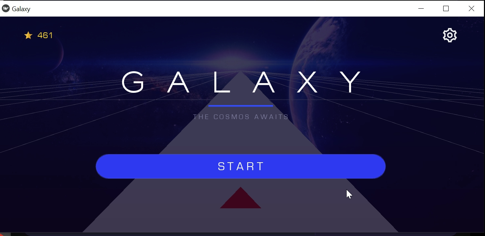

# 🚀 Galaxy Ship

A fast-paced, perspective-scrolling arcade game built with Python & Kivy

[](https://www.python.org/)
[](https://kivy.org/)
[](LICENSE)

---

## ⭐ Star This Project

If you find this game fun or the code helpful, **please give it a star!** ⭐  
It helps the project grow and motivates further development.

[](https://github.com/gourav-1711/Galaxy_ship_python_game)

**[⭐ Click here to Star the repo ⭐](https://github.com/gourav-1711/Galaxy_ship_python_game)**

---

## 🎮 About

Galaxy Ship is an endless runner-style arcade game where you pilot a ship down an infinite scrolling path. Navigate through narrowing lanes, dodge obstacles, and chase your high score — all rendered in a beautiful 3D-perspective view.

### ✨ Key Features

- 🌌 **3D Perspective Scrolling** — dynamic vanishing-point rendering
- 🎨 **Customizable Colors** — choose from 6 color presets for lines, tiles, and ship
- ⏸️ **Pause & Resume** — take a breather mid-game
- 🏆 **High Score Tracking** — scores persist between sessions via JSON storage
- 🔊 **Immersive Audio** — menu music, in-game soundtrack, and sound effects
- ⌨️ **Keyboard & Touch Controls** — play on desktop or mobile
- ⚡ **Progressive Difficulty** — speed increases and lanes narrow over time

---

## Screenshots



_Main gameplay showing the 3D perspective scrolling and ship navigation_

---

## Installation

### Prerequisites

- **Python 3.12+**
- **uv** (recommended) or **pip**

### Quick Start

```bash
# Clone the repository
git clone https://github.com/gourav-1711/Galaxy_ship_python_game.git
cd Galaxy_ship_python_game

# Install dependencies with uv
uv sync

# Run the game
uv run main.py
```

### Alternative (pip)

```bash
pip install kivy[full]
python main.py
```

---

## 🎯 How to Play

| Control       | Action         |
| ------------- | -------------- |
|  `←`     | Move Left      |
|  `→`     | Move Right     |
| Touch (left)  | Move Left      |
| Touch (right) | Move Right     |
| Pause Button  | Pause / Resume |

**Objective:** Stay on the tiles and survive as long as possible. The speed increases and the path narrows — how far can you go?

---

## 📁 Project Structure

```
Galaxy_ship_python_game/
├── 📁 assets
│   ├── 📁 audio
│   │   ├── 🎵 begin.wav
│   │   ├── 🎵 click.wav
│   │   ├── 🎵 galaxy.wav
│   │   ├── 🎵 gameover_impact.wav
│   │   ├── 🎵 gameover_voice.wav
│   │   ├── 🎵 menu.mp3
│   │   ├── 🎵 music1.wav
│   │   └── 🎵 restart.wav
│   ├── 📁 fonts
│   │   ├── 📄 Eurostile.ttf
│   │   └── 📄 Sackers-Gothic-Std-Light.ttf
│   └── 📁 images
│       ├── 🖼️ bars.png
│       ├── 🖼️ bg1.jpg
│       ├── 🖼️ gear_icon.png
│       └── 🖼️ star_icon.png
├── 📁 src
│   ├── 📁 game_files          # Core game logic
│   │   ├── 🐍 audio.py        # Sound initialization
│   │   ├── 🐍 controls.py     # Keyboard & touch input
│   │   ├── 🐍 game_manager.py # Game state management
│   │   ├── 🐍 land_tiles.py   # Tile generation & rendering
│   │   ├── 🐍 lines_gen.py    # Line generation & rendering
│   │   ├── 🐍 ship.py         # Ship rendering & collision
│   │   └── 🐍 transform.py    # 3D perspective transforms
│   └── 📁 screens             # UI screens
│       ├── 📄 menu.kv          # Menu layout
│       ├── 🐍 menu.py          # Menu logic
│       ├── 📄 pause.kv         # Pause screen layout
│       ├── 🐍 pause.py         # Pause screen logic
│       ├── 📄 restart.kv       # Game over layout
│       ├── 🐍 restart.py       # Game over logic
│       ├── 📄 settings.kv      # Settings layout
│       └── 🐍 settings.py      # Settings & color persistence
├── 📄 galaxy.kv                # Main UI layout
├── 🐍 main.py                  # Application entry point
├── ⚙️ pyproject.toml           # Project config & dependencies
└── 📄 README.md
```

---

## 🧰 Tech Stack

| Technology           | Purpose                           |
| -------------------- | --------------------------------- |
| **Python 3.12**      | Core language                     |
| **Kivy 2.3.1**       | Cross-platform UI framework       |
| **Kivy KV Language** | Declarative UI layouts            |
| **JsonStore**        | Persistent settings & high scores |
| **uv**               | Package management                |

---

## 🤝 Contributing

Contributions are welcome! Feel free to:

1. **Fork** the repository
2. Create a **feature branch** (`git checkout -b feature/amazing-feature`)
3. **Commit** your changes (`git commit -m 'Add amazing feature'`)
4. **Push** to the branch (`git push origin feature/amazing-feature`)
5. Open a **Pull Request**

---

## 📜 License

This project is open source and available under the [MIT License](LICENSE).

---

Made with ❤️ and Python

⭐ **Don't forget to star this repo if you liked it!** ⭐

[](https://github.com/gourav-1711/Galaxy_ship_python_game/stargazers)
